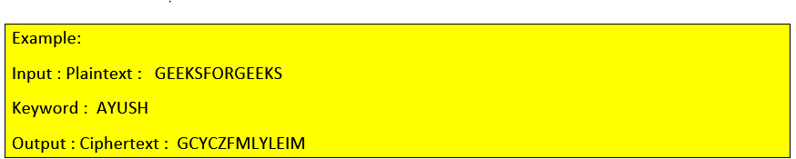
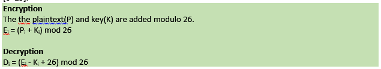

# Vigenère’s cipher 
>Vigenere Cipher is a method of encrypting alphabetic text. It uses a simple form of polyalphabetic substitution. A polyalphabetic cipher is any cipher based on substitution, using multiple substitution alphabets .The encryption of the original text is done using the Vigenère square or Vigenère table.

[![Build Status][travis-image]][travis-url]

## Usage example

To use program, you would enter a secrect message, then a secet key word to encypt the message. 

## Release History

* 0.2.1
    * CHANGE: Update docs 
    * ADD: Add `init()`
* 0.2.0
    FIX: Crash when a space was just entered 
* 0.1.1
    * FIX: Crash when typing in different case letters
* 0.1.0
    * The first proper release
    * CHANGE: how the message being encrpyed to ascii
* 0.0.1
    * Work in progress

## Meta

Jonathan Hernandez – jhernandez86@student.rccd.edu

Distributed under the XYZ license. See ``LICENSE`` for more information.

## Contributing

1. Fork it (<https://github.com/yourname/yourproject/fork>)
2. Create your feature branch (`git checkout -b feature/fooBar`)
3. Commit your changes (`git commit -am 'Add some fooBar'`)
4. Push to the branch (`git push origin feature/fooBar`)
5. Create a new Pull Request

<!-- Markdown link & img dfn's -->
[npm-image]: https://img.shields.io/npm/v/datadog-metrics.svg?style=flat-square
[npm-url]: https://npmjs.org/package/datadog-metrics
[npm-downloads]: https://img.shields.io/npm/dm/datadog-metrics.svg?style=flat-square
[travis-image]: https://img.shields.io/travis/dbader/node-datadog-metrics/master.svg?style=flat-square
[travis-url]: https://travis-ci.org/dbader/node-datadog-metrics
[wiki]: https://github.com/yourname/yourproject/wiki
